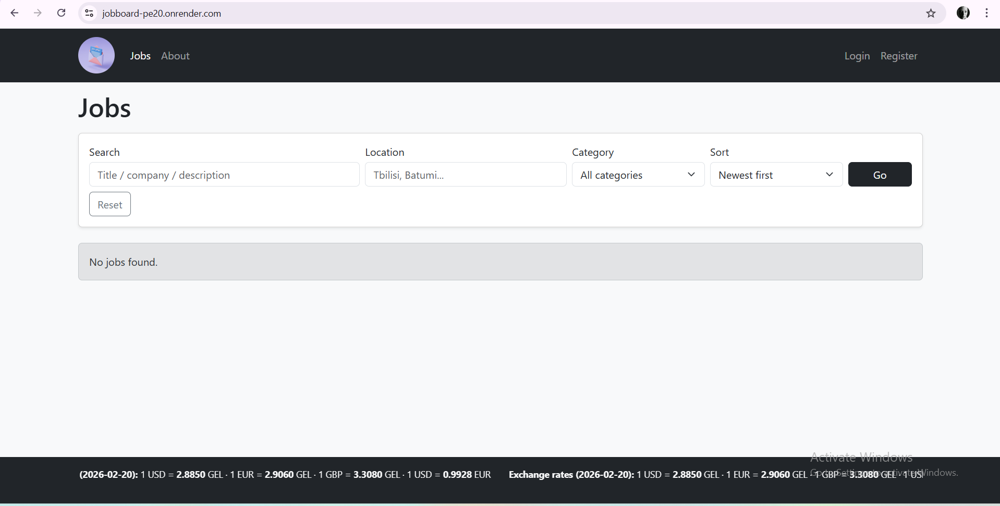
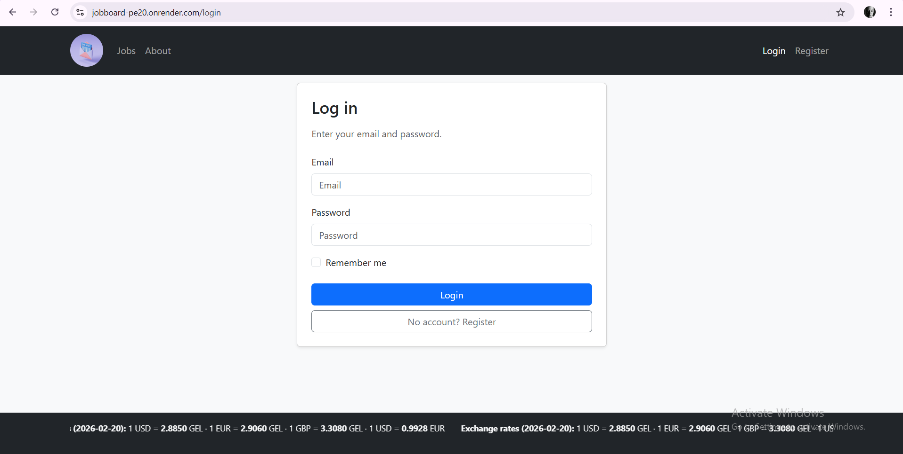
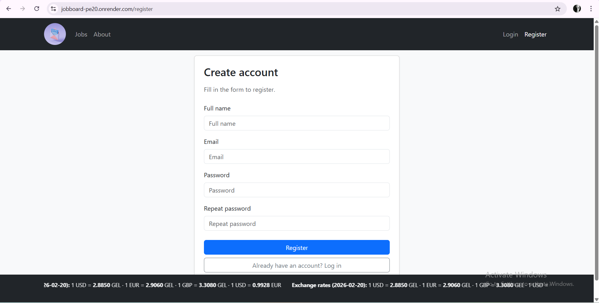

# Job Board (Flask) — Deployed

Live demo: https://jobboard-pe20.onrender.com/

A full-stack Job Board web application built with Flask. Includes authentication, job posting management, categories, and user profiles. Deployed to Render.

## Features
- User registration / login / logout
- Password hashing, session-based authentication (Flask-Login)
- Job posts CRUD (create, view, edit, delete)
- Categories support
- User profile (basic)
- Forms validation (WTForms) + CSRF protection
- Logging (auth events and key actions)
- Production deployment on Render (Gunicorn)

## Tech Stack
- Python, Flask
- SQLAlchemy ORM
- WTForms, Flask-Login, Flask-WTF (CSRF)
- SQLite (local) / production-ready config
- Gunicorn, Render

## Run Locally

### 1) Clone
```bash
git clone https://github.com/Nanuka-1/jobboard.git
cd jobboard

## Deployment
Deployed on Render:
https://jobboard-pe20.onrender.com/

## Screenshots

### Home


### Login


### Register


## Author
Nanuka Apriamova
